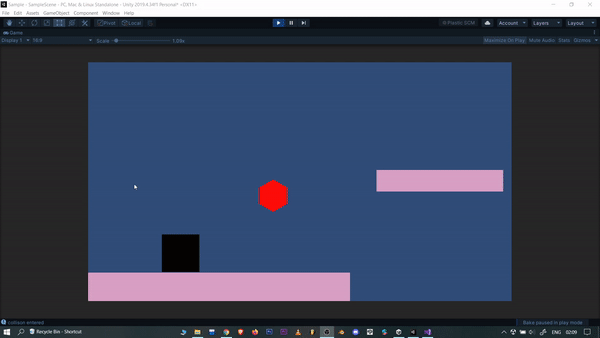

# Power-Ups

What makes a game interesting to play???🤔🤔 is it the story?? maybe, is it the player??? not so much, it is the game power ups that make the game more interesting, because they are in the favour of player which hypes up the users very much more 😍😍
     
    

If you want to make your game interesting then add the feature of Power-ups and Collectibles. Power-ups are nothing but collecting items or points which will give the player a special ability. The ability could be anything- double jump, dash, or some attacks. 

Here, you will learn how to implement Power-Ups or Collectibles.

1. Drop a game object in the scene view.
2. Use a collider and in the collider component click ✅ the “Is Trigger” option.
3. Now, while implementing the logic, use compares tag to compare with the game object it collides with and after the collision, destroy the power-up game object.

You can add tons of features here like, after collecting the item enabling the double jump ability to the player for some seconds. This way, the player could only double jump if he gets the power up feature and that too for a limited period of time. To do this you can add a timer or use coroutines, for which you can read in the Dash mechanism section. 

Refer to the clip below to get an idea of what to implement

Here, after getting the red game object, which is a collectable item here, the player(black square object) could move much higher and enabled the double jump ability for 5 secs. Also, observe the timer on the top-right. That’s what you have to implement and of course, go beyond this project with your imagination and implement as many as cool features you want to.  

## A. Single/Double/Triple Jump

- Player Jump is one of the most crucial elements for this project. Before making the double jump or triple jump first, go through the *Player Movement* section to get an idea of how you can use physics in a particular game object to move it. Also, get yourself familiarized with the RigidBody2D, BoxCollider2D components.
    - Single Jump: If you have tried to write a code for jump mechanics then you must have seen how the game object behaves when pressing the attached input. It goes infinite at a one-time press. How to fix it? *Hint:* Limit it by using a **bool value**. Also, do not forget to read about *Collison Detection* as it is important for this task.
        
        Here is a code where you can get an idea of how to do it.
        
        

        Also, this is not the end. You need to write a logic for OnCollisionExit2D as well. Do it by yourself. It will boost your confidence.

    - Double Jump: Can we use a counter for it? 🤔 It’s like if you press the UP Arrow key once, then it will count for 1 time and jump once. If pressed twice then it will count for 2 times and jump twice. hmmmmmm.... ????? But how to implement it?
    
        Let’s see a code and understand it.
        
        
        
        Here, the counter is extraJump variable. By default, the game object has the ability to jump by once. So when extraJump is 1 then the game object will jump twice. The extraJump will only be available if the game object stands on the ground platform. The value of extraJump is decreased to zero so that when the player inputs the bound key(UP-ARROW) the second time, the extraJump would become 0, and the next time if the player continuously presses the key again, it wouldn't affect anything to the game object and the player won't be able to jump more than twice.
        
    - Triple Jump: Change the value of extraJump to 2. 
      You can use any number of jumps depending upon what you want in your game.
      
      

## B. Dash mechanism

Many game characters will have the ability to rocket forward or backwards with their legs trailing after them as if firing a jet-pack horizontally, though they usually aren’t wearing one. When doing this, they will be able to travel a distance many times the length of their body in a split second. This move tends to be triggered by tapping or flicking the same direction more than once but some games can also have a dedicated ‘dash button’.

There are many ways to implement this feature. For this game, we will try to implement a simple Dash using a dedicated dash button, let’s say the ‘Shift’ button on the keyboard. Now, imagine the requirements for this feature, we need a duration for which the dash will be active, and then maybe a cool down duration after which the dash can happen again.

A very common approach to solving this is using IEnumerators. ([https://docs.unity3d.com/ScriptReference/MonoBehaviour.StartCoroutine.html](https://docs.unity3d.com/ScriptReference/MonoBehaviour.StartCoroutine.html))

In order to understand, we need to go through what is Coroutine first. [MonoBehaviour.StartCoroutine](https://docs.unity3d.com/ScriptReference/MonoBehaviour.StartCoroutine.html) returns a Coroutine. Instances of this class are only used to reference these coroutines and do not hold any exposed properties or functions.

A coroutine is a function that can suspend its execution (yield) until the given [YieldInstruction](https://docs.unity3d.com/ScriptReference/YieldInstruction.html) finishes. For the dash function, we actually need to wait for duration till the dash is completed and only after the cooldown period, allow the player to re-use the dash.

The following script shows how the Dash can be implemented inside the Update:

And the dashCoroutine IEnumerator: 

And Finally applying the impulse force in physics for the RigidBody: 

Of course, it would also be great if a collectable is implemented upon picking up which, the player would get the ability to dash. The Cooldown time should also be set as such so that it cannot be used continuously rather only after a certain amount of time, after having used it once. In the above script, we have demonstrated that to be 2 seconds, but you should set this as required by your game. The below video shows a quick animation of how this has been implemented for a 2D platformer game : 

As shown above, you can see the Player dashes as soon as ‘LShift’ key is input. It would be an additional achievement if you can use a particle system or any other way to show a trailing effect when the dash happens. Remember to lock the dash ability at the start, but only activate it once a collectable/item has been picked up.

## Wrapping Up
   
We covered a lot in this one. Feel free to take a breather over here.

Maybe share your progress with the world via LinkedIn & Twitter?

Once you're done posting fill this [form](https://airtable.com/shrXGSkgf5NClpoIU) so that we can also track your progress and give you cool stuff for getting this far!

