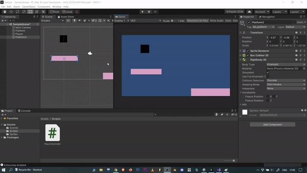

# Falling Platforms

More Features???😍 Yeahhhh 🔥

You can add so many features to your game to make it challenging and engaging to the gamers. 

One such feature is the falling of a platform when the player jumps over it or stands on it. It’s not so tough to implement if you think logically. It is all about the physics mechanism that would require to make a game object (here, it is the ‘platform’) fall when the player stands on it. 

Refer to the clip below to understand what we want you to implement. 

*Hints:* By default, the body type of the rigidbody component is Dynamic. Make it to Kinematic. Now, get the rigidbody component of the platform game object. Compare it with the player game object when both of them collide with each other. On collision, change the body type of the platform from kinematic to dynamic.

The reason why we would want to change the body type from dynamic to kinematic and vice-versa is simple-

- The Kinematic body type ignores all the forces that act on it.
- The Dynamic body type affects by all the forces that act on it.

You can also add the ‘Game Over’ feature if the player falls to the ground and nowhere along with the platform. Refer to the Game Over section to implement this feature.

---
